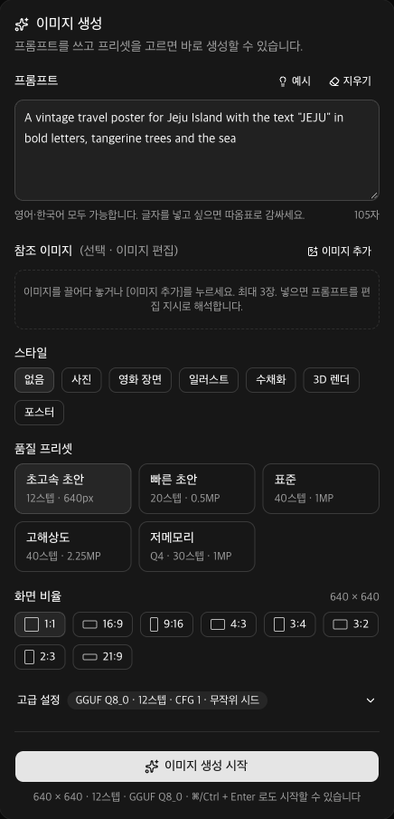

# Qwen Image Studio

Apple Silicon Mac 에서 [Qwen-Image-2.1](https://huggingface.co/Qwen/Qwen-Image-2.1) 을 로컬로 돌리는 이미지 생성 스튜디오입니다.
프리셋과 상세 옵션으로 이미지를 만들고, 진행률과 미리보기를 실시간으로 보며, 참조 이미지를 넣어 편집하고, 결과를 갤러리에서 관리합니다.



- **웹 앱** (`web/`): Next.js 16 + shadcn/ui. 비동기 대기열, SSE 실시간 진행률·미리보기, 참조 이미지 편집, 갤러리 검색·삭제·재생성
- **ComfyUI + GGUF** 백엔드: 양자화 모델로 36GB 메모리에서 동작. 웹 앱이 ComfyUI 를 자동으로 켭니다
- **mflux(MLX)** 백엔드: bf16 원본 가중치를 Apple MLX 로 실행하는 대안 경로
- **GGUF 텍스트 인코더 지원**: ComfyUI-GGUF 가 읽지 못하는 Qwen3-VL 비전 타워를 붙여 주는 보완 모듈 포함

## 요구 사항

| 항목 | 내용 |
| --- | --- |
| 하드웨어 | Apple Silicon Mac, 통합 메모리 32GB 이상 권장 (M4 Max 36GB 에서 개발·측정) |
| 디스크 | ComfyUI 경로 약 25GB, mflux 경로 추가 33GB |
| 도구 | [uv](https://docs.astral.sh/uv/), git, Node.js 20 이상, macOS 14 이상 |

## 빠른 시작

```bash
git clone https://github.com/revfactory/qwen-image-studio.git
cd qwen-image-studio
./setup-comfyui.sh      # ComfyUI·ComfyUI-GGUF 클론, 가상환경, 모델 약 18GB 다운로드, 웹 앱 의존성
./run-web.sh            # http://127.0.0.1:3210
```

첫 생성을 시작하면 ComfyUI 서버가 자동으로 켜집니다(1분 안팎). 터미널만 쓰려면 `./run-comfyui.sh` 뒤에 `./comfy-generate.py "프롬프트"` 를 실행합니다.
아래는 각 경로의 자세한 설명입니다. 실측 수치는 M4 Max 36GB 기준입니다.

## 모델 정보

| 항목 | 값 |
| --- | --- |
| 모델 | Qwen-Image-2.1 (2026년 9월 20일 공개), 7.1B 단일 스트림 DiT + Qwen3-VL 8B 텍스트 인코더 |
| ComfyUI 경로 가중치 | [abenzerps/Qwen-Image-2.1-GGUF](https://huggingface.co/abenzerps/Qwen-Image-2.1-GGUF) (Q8_0 7.6GB / Q4_K_M 4.6GB), [Comfy-Org/Qwen-Image-2.1](https://huggingface.co/Comfy-Org/Qwen-Image-2.1) (int8 인코더 9.4GB, VAE 0.7GB) |
| mflux 경로 가중치 | `Qwen/Qwen-Image-2.1` bf16 33GB (`~/.cache/huggingface/hub/`) |

## 방법 1: mflux (Apple MLX)

`uv tool install --python 3.12 mflux` 로 mflux 를 설치하면 첫 실행 때 `Qwen/Qwen-Image-2.1` 가중치(33GB)를 내려받습니다.
mflux 0.20.0 기준입니다.

### 사용법

```bash
./generate.sh "프롬프트" [출력파일.png] [mflux 추가 옵션...]
```

예시:

```bash
./generate.sh "A neon shop sign that reads \"QWEN IMAGE 2.1\", rainy night, reflections on wet pavement" outputs/neon.png --seed 42
./generate.sh "수묵화 느낌의 호랑이" outputs/tiger.png --width 1280 --height 720
```

`generate.sh` 는 다음 명령을 감싼 것입니다.

```bash
mflux-generate-qwen-2.1 --model qwen-image-2.1 -q 8 --low-ram \
  --steps 40 --width 1024 --height 1024 \
  --prompt "..." --output outputs/result.png
```

### 주요 옵션

| 옵션 | 설명 |
| --- | --- |
| `--steps` | 샘플링 스텝. 공식 권장값 40. 20 정도로 낮추면 속도가 2배 빨라지지만 품질이 떨어집니다 |
| `-q` / `--quantize` | 트랜스포머 양자화 비트(3/4/5/6/8). 8이 품질 손실이 가장 적습니다 |
| `--seed` | 시드 고정. 여러 개를 나열하면 여러 장을 연속 생성합니다 |
| `--width`, `--height` | 해상도. 16의 배수. 1:1, 4:3, 3:4, 3:2, 2:3, 16:9, 9:16 비율 지원 |
| `--negative-prompt`, `--guidance` | 기본은 가이던스 없음(1.0). 부정 프롬프트를 쓰려면 `--guidance 2.5` 정도와 함께 지정 |
| `--image 경로 [강도]` | img2img. 강도 기본값 0.4 |
| `--low-ram` | MLX 캐시를 1GB로 제한하고 VAE 를 타일 단위로 디코딩해 최대 메모리를 줄입니다 |

## 메모리 안내 (36GB 장비 기준)

- 텍스트 인코더는 양자화되지 않아 로딩 시점에 약 17.5GB 를 차지합니다. `-q 8` 이면 트랜스포머는 약 7GB 이므로 로딩 직후 최대 약 26GB 가 필요합니다.
- mflux 는 프롬프트 인코딩이 끝나면 텍스트 인코더를 즉시 해제하므로, 실제 디노이징 중에는 10GB 안팎만 사용합니다.
- 다른 앱이 메모리를 많이 쓰고 있으면 로딩 단계에서 스왑이 발생해 느려집니다. 생성 전에 브라우저 탭·IDE 등을 정리하는 것이 좋습니다.
- 메모리 부족 오류가 나면 `QWEN_Q=6 ./generate.sh ...` 또는 `QWEN_Q=4 ./generate.sh ...` 로 낮춰 보세요.
- 2048×2048 같은 고해상도는 활성화 메모리가 크게 늘어나므로 1024~1280 급 해상도를 권장합니다.

## 방법 2: ComfyUI + GGUF (abenzerps/Qwen-Image-2.1-GGUF)

[abenzerps/Qwen-Image-2.1-GGUF](https://huggingface.co/abenzerps/Qwen-Image-2.1-GGUF) 의 GGUF 양자화 가중치를
ComfyUI 와 [leejet/ComfyUI-GGUF](https://github.com/leejet/ComfyUI-GGUF) 커스텀 노드로 실행하는 구성입니다.
모델 카드가 안내하는 공식 조합 그대로이며, `./setup-comfyui.sh` 가 아래 구성을 자동으로 만듭니다.

### 구성

| 항목 | 값 |
| --- | --- |
| ComfyUI | `ComfyUI/` (`setup-comfyui.sh` 가 클론. 0.37.0, 가상환경 `ComfyUI/.venv`, Python 3.12, PyTorch 2.14 MPS) |
| 커스텀 노드 | `ComfyUI/custom_nodes/ComfyUI-GGUF` (leejet 포크, Qwen-Image-2.1 아키텍처 지원) |
| 디퓨전 모델 | `ComfyUI/models/diffusion_models/qwen-image-2.1-Q8_0.gguf` (7.6GB), `qwen-image-2.1-Q4_K_M.gguf` (4.6GB) |
| 텍스트 인코더 | `ComfyUI/models/text_encoders/qwen3vl_8b_int8_convrot.safetensors` (9.35GB, int8) |
| VAE | `ComfyUI/models/vae/qwen_image_2.1_vae_bf16.safetensors` (0.7GB) |

텍스트 인코더와 VAE 는 GGUF 저장소가 원본으로 밝힌 Comfy-Org/Qwen-Image-2.1 에서 받았으며, 해시가 동일한 파일입니다.

### 서버 실행

```bash
./run-comfyui.sh
```

브라우저에서 <http://127.0.0.1:8188> 을 열면 ComfyUI 화면이 뜹니다.
공식 템플릿(`qwen21_t2i_template.json`)을 드래그해 불러온 뒤, 서브그래프 안의 `UNETLoader` 노드를
`Unet Loader (GGUF)` 로 바꾸고 `.gguf` 파일을 고르면 됩니다. `CLIPLoader` 의 type 은 `qwen_image` 입니다.

### 터미널에서 생성

서버를 띄운 상태에서 다른 터미널에서 실행합니다.

```bash
./comfy-generate.py "프롬프트" -o outputs/result.png
./comfy-generate.py "프롬프트" --gguf Q4_K_M --steps 25 --seed 42 --width 1280 --height 720
```

| 옵션 | 기본값 | 설명 |
| --- | --- | --- |
| `--gguf` | `Q8_0` | `Q8_0`(품질 우선) 또는 `Q4_K_M`(용량 우선). Mac MPS 에서는 4비트 언패킹 비용 때문에 Q8_0 이 오히려 빠릅니다 |
| `--text-encoder` | `int8` | `bf16` 을 쓰려면 `qwen3vl_8b_bf16.safetensors`(17.5GB) 를 `models/text_encoders/` 에 추가로 내려받아야 합니다 |
| `--steps` | 40 | 공식 템플릿 기본값은 25 |
| `--cfg` | 1.0 | 부정 프롬프트를 쓸 때만 올립니다 |
| `--seed`, `--width`, `--height` | 랜덤, 1024, 1024 | 해상도는 32의 배수 권장 |

### 속도를 올리는 방법

| 프리셋 | 설정 | 실측 |
| --- | --- | --- |
| 초고속 초안 | 640², 12스텝, Q8_0, Heretic Q4 인코더(설치돼 있을 때) | 46초 (스텝당 2.8초) |
| 빠른 초안 | 약 736², 20스텝 | 75~100초 |
| 표준 | 1024², 40스텝 | 메모리 여유가 있을 때 5~6분, 스왑이 생기면 8분 이상 |

- 시간은 스텝 수에 비례하고, 해상도에는 제곱 가까이 비례합니다. 초안은 작은 크기로 여러 장 뽑고 마음에 드는 시드만 1024² 로 다시 생성하는 것이 가장 빠릅니다.
- 메모리 여유가 가장 큰 변수입니다. 다른 앱을 닫고, mflux 와 ComfyUI 를 동시에 돌리지 말고, 참조 이미지는 1장만 쓰세요. Heretic Q4 인코더는 int8 인코더보다 4GB 를 덜 씁니다.
- CFG 는 1 로 두고(1 보다 크면 스텝당 계산이 두 배), 샘플러는 euler·simple 을 유지하세요. Mac 에서는 GGUF Q8_0 이 Q4 보다 빠릅니다.
- 2.1 용 Lightning(증류) LoRA 는 아직 공개되지 않았습니다. 나오면 4~8스텝으로 5~10배 빨라집니다.

### 실측 결과 (M4 Max 36GB, 1024×1024, 40스텝, 시드 42)

| 경로 | 소요 시간 | 스텝 속도 | 메모리 | 비고 |
| --- | --- | --- | --- | --- |
| mflux, bf16 → q8 | 6분 36초 | 7~14초/스텝 | 최대 MLX 15.5GB | `outputs/neon_sign.png` |
| ComfyUI, GGUF Q8_0 + int8 TE | 11분 21초 | 약 11초/스텝 | 프로세스 2.5GB + MPS 공유 메모리 | `outputs/neon_sign_gguf_q8.png` |

ComfyUI 측정 중에는 mflux 생성 작업이 동시에 돌아가고 있었고 스왑도 10GB 가까이 쓰이던 상태여서, 두 경로를 따로 돌리면 이보다 빨라집니다. ComfyUI 는 텍스트 인코더를 CPU 에, 디퓨전 모델은 MPS 에 올립니다.

### 주의

- mflux 와 ComfyUI 생성을 동시에 돌리면 GPU 와 메모리를 나눠 써서 둘 다 크게 느려집니다. 한 번에 하나만 실행하세요.
- ComfyUI 실행 로그는 프로젝트 루트의 `comfyui.log` 에 쌓입니다.

### mflux 방식과의 비교

| | mflux (방법 1) | ComfyUI + GGUF (방법 2) |
| --- | --- | --- |
| 엔진 | Apple MLX | PyTorch MPS |
| 디퓨전 가중치 | bf16 원본을 실행 시 8비트로 양자화 | 미리 양자화된 GGUF |
| 텍스트 인코더 | bf16 17.5GB (양자화 불가) | int8 9.35GB |
| 디스크 | 33GB | 약 22GB |
| 사용 방식 | CLI 한 줄 | GUI 워크플로 + API 스크립트 |
| 편집·참조 이미지 | 미지원 | 공식 편집 템플릿 사용 가능 |

## 방법 3: 웹 앱 (Qwen Image 2.1 Studio)

브라우저에서 프리셋과 상세 옵션으로 이미지를 생성하고, 진행률을 실시간으로 보며, 생성한 이미지를 모아 보거나 지울 수 있는 웹 앱입니다.
Next.js 16 + shadcn/ui(Base UI) 로 만들었고 `web/` 폴더에 있습니다.

### 실행

```bash
./run-web.sh          # http://127.0.0.1:3210 (프로덕션 모드, 첫 실행 시 자동 빌드)
./run-web.sh dev      # 개발 모드
./run-web.sh build    # 코드를 고친 뒤 다시 빌드
./reset-data.sh       # 작업 기록·생성 이미지·참조 이미지를 모두 삭제 (확인 후 실행, --yes 로 생략)
```

터미널을 붙잡지 않고 백그라운드로 돌리려면 `run-web-background.sh` 를 씁니다. 로그는 `web.log` 에 남습니다.

```bash
./run-web-background.sh                  # 백그라운드로 시작
./run-web-background.sh --status         # 실행 상태
./run-web-background.sh --stop           # 정지
./run-web-background.sh --stop --delete  # 데이터를 모두 지운 뒤 정지
```

ComfyUI 서버가 꺼져 있으면 첫 생성 요청 때 `run-comfyui.sh` 를 자동으로 실행합니다(준비까지 1분 안팎).
헤더의 배지에서 ComfyUI·mflux 상태와 실시간 연결 상태를 확인할 수 있습니다.
웹 앱이 자동으로 켠 ComfyUI 는 웹 앱을 종료해도 백그라운드에 남습니다. 끄려면 `pkill -f "ComfyUI/main.py"` 를 실행하세요.

### 기능

| 영역 | 내용 |
| --- | --- |
| 기본 프리셋 | 스타일(사진·영화 장면·일러스트·수채화·3D·포스터), 품질(초고속 초안·빠른 초안·표준·고해상도·저메모리), 화면 비율 8종 |
| 고급 설정 | 엔진(ComfyUI GGUF / mflux MLX), GGUF 모델·텍스트 인코더 또는 mflux 양자화 비트, 스텝, CFG 와 부정 프롬프트, 시드 고정·무작위, 임의 크기, 샘플러·스케줄러, 연속 생성 수(최대 8장) |
| 비동기 처리 | 요청은 대기열에 쌓이고 서버의 워커가 한 번에 하나씩 실행합니다. 브라우저를 닫아도 생성은 계속되고 기록은 `web/data/jobs.json` 에 남습니다 |
| 실시간 진행률 | 단계(모델 로딩 → 프롬프트 처리 → 생성 → 디코딩 → 저장), 스텝 수, 경과·남은 시간, 생성 중 미리보기 이미지를 SSE 로 전달합니다 |
| 갤러리 | 완료 이미지 격자, 프롬프트·시드 검색, 완료/실패 필터, 상세 보기(← → 로 이동), 설정 불러오기, 같은 시드·새 시드로 재생성, 참조 이미지로 추가(선택한 수만큼 배치 처리), 이 이미지 편집하기, 다운로드, 개별·선택 삭제 |
| 취소 | 대기 중 작업은 대기열에서 제거하고, 실행 중 작업은 ComfyUI 인터럽트 또는 mflux 프로세스 종료로 중단합니다 |
| 이미지 편집 | 참조 이미지를 최대 3장 올리거나(끌어다 놓기 지원) 갤러리 메뉴의 "참조 이미지로 추가"·"이 이미지 편집하기"로 불러온 뒤, 프롬프트에 편집 지시를 쓰면 Qwen-Image-2.1 의 편집 기능으로 생성합니다. 출력 크기는 첫 참조 이미지에 맞추거나 직접 지정할 수 있습니다. mflux 엔진에서는 첫 이미지만 img2img(변경 강도 조절)로 씁니다 |
| 배치 편집 | 참조 이미지를 원하는 수만큼 올리거나 보관함·갤러리에서 고른 뒤 "각 이미지에 따로 적용"을 선택하면, 같은 프롬프트를 각 이미지에 적용한 작업이 한 장마다 하나씩 만들어집니다. 4장 이상 넣으면 자동으로 이 모드가 됩니다 |
| 참조 이미지 보관함 | 지금까지 올린 참조 이미지를 모아 보고 여러 장을 골라 폼에 넣거나 서버에서 지웁니다 |
| 일괄 삭제 | 참조 이미지 "모두 제거", 갤러리 "전체 삭제"(현재 필터 기준), 터미널의 `./reset-data.sh`(작업 기록·생성 이미지·참조 이미지 전부) |

생성된 이미지는 `outputs/web/<작업 ID>.png` 에 저장되며, 갤러리에서 삭제하면 파일도 함께 지워집니다.
참조 이미지는 PNG 로 변환되어 `web/data/uploads/` 에 저장되고, ComfyUI 에는 실행 시점에 `input/qwen-studio/` 로 올라갑니다.

### 구조

| 경로 | 역할 |
| --- | --- |
| `web/src/app/page.tsx` | 화면 구성 (생성 폼, 진행 중 패널, 갤러리) |
| `web/src/components/` | `generator-form`, `active-jobs`, `gallery`, `image-dialog`, `header` |
| `web/src/hooks/use-jobs.ts` | SSE(`/api/events`) 구독과 작업 상태 관리 |
| `web/src/lib/server/queue.ts` | 직렬 작업 워커, 진행률·남은 시간 계산 |
| `web/src/lib/server/comfy.ts` | ComfyUI 연동 (워크플로 제출, 웹소켓 진행률·미리보기, 자동 시작, 취소) |
| `web/src/lib/server/mflux.ts` | mflux CLI 실행과 진행률 파싱 |
| `web/src/lib/server/store.ts` | 작업 기록 저장 (`web/data/jobs.json`) |
| `web/src/app/api/` | `jobs`(목록·생성·삭제·취소), `events`(SSE), `images/[id]`, `uploads`(참조 이미지), `status` |

환경변수 `PORT`, `COMFY_URL`, `COMFY_AUTOSTART`, `QWEN_ROOT` 로 포트·ComfyUI 주소·자동 시작·루트 폴더를 바꿀 수 있습니다.

## 텍스트 인코더 교체: Heretic GGUF (거부 완화)

[pottokao/Qwen-Image-2.1-Text-Encoder-Heretic-GGUF](https://huggingface.co/pottokao/Qwen-Image-2.1-Text-Encoder-Heretic-GGUF) 는
Qwen-Image-2.1 이 쓰는 텍스트 인코더(Qwen3-VL-8B)에서 거부 반응을 줄인(Heretic 방향 소거) 파생 모델을 GGUF Q4_K_M 으로 양자화한 것입니다.
원본 인코더가 거부하던 프롬프트를 처리하고, 크기도 int8 인코더(9.4GB)의 절반 수준입니다. Apache-2.0 으로 배포됩니다.

| 파일 | 크기 | 용도 |
| --- | --- | --- |
| `qwen3vl_8b_heretic-Q4_K_M.gguf` | 5.0GB | 언어 모델. 텍스트→이미지 생성에 필요 |
| `mmproj-qwen3vl_8b_heretic-f16.gguf` | 1.2GB | 비전 타워. 참조 이미지 편집용(아래 제한 참고) |

### 설치

```bash
./install-text-encoder-heretic.sh              # 두 파일 모두 설치 (약 6.2GB)
./install-text-encoder-heretic.sh --text-only  # 언어 모델만 설치
./install-text-encoder-heretic.sh --check      # 설치 상태와 SHA256 확인
./install-text-encoder-heretic.sh --force      # 다시 내려받기
```

스크립트는 허깅페이스 API 에서 파일 크기와 SHA256 을 받아 내려받은 파일을 검증하고, `ComfyUI/models/text_encoders/` 에 넣습니다.
이미 있는 파일은 건너뛰며, 디스크 여유가 부족하면 시작하지 않습니다. `uv`(uvx) 와 `python3` 가 필요합니다.
전송 중 "error decoding response body" 같은 오류로 끊기면 같은 명령을 다시 실행하면 이어서 받습니다.

### 실행

| 방법 | 사용법 |
| --- | --- |
| 웹 앱 | 고급 설정 → 텍스트 인코더에서 "Heretic Q4_K_M (GGUF · 거부 완화)" 선택. ComfyUI 가 켜져 있으면 목록은 15초 안에 갱신됩니다 |
| 터미널 | `./comfy-generate.py "프롬프트" --text-encoder heretic` |
| ComfyUI 화면 | `CLIPLoader` 대신 ComfyUI-GGUF 의 `CLIPLoader (GGUF)` 노드를 놓고 `qwen3vl_8b_heretic-Q4_K_M.gguf` 를 고른 뒤 type 을 `qwen_image` 로 둡니다 |

GGUF 인코더는 ComfyUI-GGUF 가 실행 중에 역양자화하며, 이 장비에서는 텍스트 인코더가 CPU 에서 돌기 때문에 첫 프롬프트 인코딩이 int8 인코더보다 조금 더 걸릴 수 있습니다.

### 참조 이미지 편집과 비전 타워

ComfyUI-GGUF(leejet 포크와 원본 city96 모두)는 Qwen2-VL 의 비전 타워만 자동으로 읽고, Qwen3-VL 용 `mmproj` 는 읽지 않습니다.
그대로 두면 GGUF 인코더로 참조 이미지를 인식하지 못해 편집 결과가 깨집니다.
그래서 `ComfyUI/custom_nodes/qwen-studio-gguf-qwen3vl/` 에 보완 모듈을 두었습니다. 이 모듈은 ComfyUI-GGUF 의 텍스트 인코더 로더를 감싸,
아키텍처가 `qwen3vl` 인 GGUF 인코더를 읽을 때 같은 폴더의 `mmproj-*.gguf` 를 찾아 ComfyUI 의 `model.visual.*` 키 이름으로 옮겨 넣습니다.
노드를 추가하지는 않으며, ComfyUI 로그에 "Qwen3-VL 비전 타워 352개 텐서를 붙였습니다" 가 찍히면 정상입니다.

- 비전 타워 파일은 인코더와 같은 폴더에 있어야 하고, 이름에 `mmproj` 와 인코더 이름(양자화 접미사 제외)이 들어 있어야 합니다.
- `--text-only` 로 언어 모델만 설치했다면 편집 시 비전 타워를 찾지 못한다는 오류가 로그에 남고 결과가 깨집니다. 이때는 스크립트를 옵션 없이 다시 실행해 mmproj 를 받으세요.
- 웹 앱 코드의 `GGUF_TEXT_ENCODER_SUPPORTS_EDIT` 를 `false` 로 바꾸면 편집 작업에서 GGUF 인코더 대신 int8 인코더를 자동으로 쓰도록 되돌릴 수 있습니다.
- mflux 경로는 GGUF 인코더를 쓰지 않습니다.

## 현재 mflux 포트의 제한

- 이미지 편집(instruction edit) 변형, LoRA, 투명(RGBA) 출력은 아직 지원되지 않습니다. 텍스트→이미지와 img2img 만 가능합니다.
- 텍스트 프리픽스 KV 캐시 최적화가 아직 적용되지 않아, 향후 버전에서 속도가 더 빨라질 여지가 있습니다.

## 업데이트

```bash
uv tool upgrade mflux
```

## 폴더 구성

| 경로 | 내용 |
| --- | --- |
| `setup-comfyui.sh` | ComfyUI·ComfyUI-GGUF·가상환경·모델·웹 앱 의존성을 한 번에 구성 |
| `run-web.sh` | 웹 앱 실행 (방법 3) |
| `run-comfyui.sh` | ComfyUI 서버 실행 (방법 2) |
| `comfy-generate.py` | ComfyUI API 로 생성하는 CLI (방법 2) |
| `generate.sh` | mflux 로 생성하는 스크립트 (방법 1) |
| `install-text-encoder-heretic.sh` | Heretic GGUF 텍스트 인코더 설치 |
| `custom_nodes/qwen-studio-gguf-qwen3vl/` | GGUF 인코더에 Qwen3-VL 비전 타워(mmproj)를 붙이는 ComfyUI 보완 모듈. `ComfyUI/custom_nodes/` 에 링크됨 |
| `web/` | 웹 앱 (Next.js + shadcn/ui) |
| `qwen21_t2i_template.json`, `qwen21_edit_template.json` | Comfy-Org 공식 워크플로 템플릿 (ComfyUI 화면에 끌어다 놓아 사용) |
| `ComfyUI/`, `outputs/`, `web/data/` | 실행 환경·생성 결과·작업 기록. git 에 포함되지 않음 |

## 라이선스

이 저장소의 코드는 MIT 라이선스입니다. ComfyUI(GPL-3.0), ComfyUI-GGUF(Apache-2.0), mflux(MIT) 와 모델 가중치(Qwen 라이선스, Heretic 인코더는 Apache-2.0)는 각자의 라이선스를 따릅니다.
